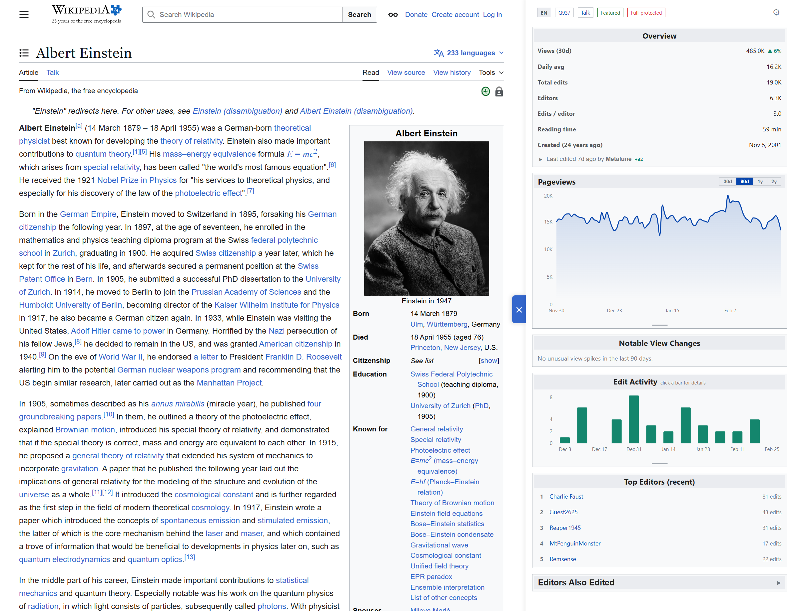
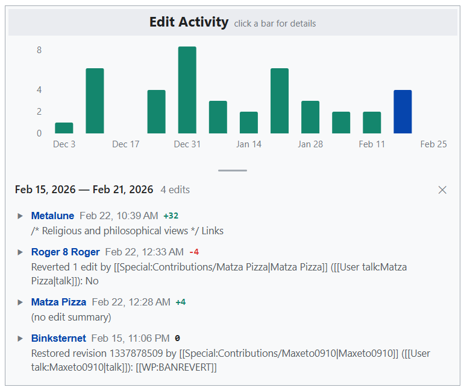
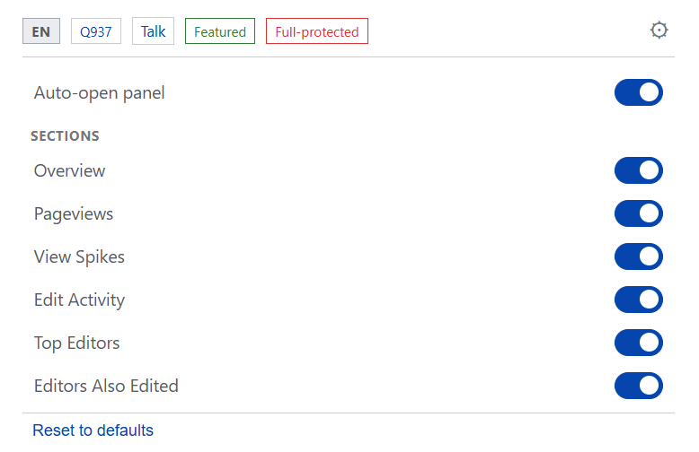

<p align="center">
  
</p>

<h1 align="center">WikiStat</h1>

<p align="center">
  A Chrome extension that surfaces Wikipedia article statistics in a side panel — pageviews, edit activity, top editors, view spikes, article quality, and more.
</p>

<p align="center">
  
  
  
  
</p>

<p align="center">
  <a href="https://chromewebstore.google.com/detail/wikistat/ofmhbinbkgbiebdniclmnhamgcjichgf?hl=en">
    
  </a>
</p>

---

<p align="center">
  
</p>

## Features

| Feature | Description |
|---------|-------------|
| **Pageview Charts** | Interactive area chart with 30d / 90d / 1y / 2y range selector. Spike days highlighted in orange. |
| **View Spike Detection** | Automatically flags days with 1.75x+ the rolling 14-day median. "Why the spike?" links to Google News around that date. |
| **Edit Activity** | Bar chart of daily/weekly/monthly edit counts. Click any bar to expand individual revisions with inline diffs. |
| **Top Editors** | Ranked list of the most active editors on the article, linked to their Wikipedia user pages. |
| **Editors Also Edited** | Discover related articles by finding pages co-edited by the article's top contributors. |
| **Article Quality** | Displays the article's quality class (Featured, Good, B, C, Start, Stub) from Wikimedia's Lift Wing model. |
| **Trending Detection** | Shows the article's ranking on Wikipedia's most-viewed pages if it's trending today. |
| **Protection Status** | Indicates whether the page is semi-protected, extended-protected, or fully protected. |
| **Dark Mode** | Automatically matches Wikipedia's dark theme (Vector 2022). |
| **Resizable Charts** | Drag the handle below any chart to resize it. Heights persist across sessions. |
| **Section Visibility** | Toggle individual sections on/off from the settings menu. |
| **Auto-open Control** | Choose whether the panel opens automatically on Wikipedia pages or only on demand. |

<p align="center">
  
  
</p>

## How It Works

WikiStat injects a side panel into Wikipedia article pages. When you navigate to an article, it fetches data from multiple Wikimedia APIs:

- **Pageviews API** — daily view counts for the past 2 years
- **Action API** — edit counts, editor counts, revision history, page protection, Wikidata ID
- **Lift Wing API** — article quality predictions
- **Wikimedia REST API** — trending/most-viewed articles

All API responses are cached locally (`chrome.storage.local`) with appropriate TTLs to minimize redundant requests.

## Architecture

```
extension/
├── entrypoints/
│   ├── content.ts          # Injected into Wikipedia — creates side panel iframe + toggle tab
│   ├── background.ts       # Service worker — session storage access level setup
│   ├── panel/              # Side panel React app
│   │   ├── App.tsx          # Main component — data fetching, section rendering, settings
│   │   ├── components/      # ViewsChart, EditsChart, TopEditors, ViewSpikes, etc.
│   │   └── style.css        # Wikipedia-inspired styles (Vector 2022 / Codex tokens)
│   └── popup/              # Toolbar popup — quick status + auto-open toggle
├── lib/
│   ├── wikipedia-api.ts    # All Wikimedia API calls + caching
│   ├── storage.ts          # chrome.storage.sync (preferences) + local (cache) helpers
│   ├── types.ts            # TypeScript interfaces for articles, stats, preferences
│   └── format.ts           # Shared formatting utilities (numbers, bytes, time ago)
├── e2e/                    # Playwright end-to-end tests
├── wxt.config.ts           # WXT build configuration + manifest
└── package.json
```

**Tech stack:** [WXT](https://wxt.dev) 0.20 + React 19 + [Recharts](https://recharts.org) + TypeScript, targeting Chrome Manifest V3.

## Getting Started

### Prerequisites

- [Node.js](https://nodejs.org/) 18+
- npm

### Install & Build

```bash
cd extension
npm install
npm run build
```

The built extension will be in `extension/.output/chrome-mv3/`.

### Load in Chrome

1. Open `chrome://extensions`
2. Enable **Developer mode** (top-right toggle)
3. Click **Load unpacked**
4. Select the `extension/.output/chrome-mv3/` folder
5. Navigate to any Wikipedia article — the WikiStat panel appears on the right

### Development

```bash
cd extension
npm run dev
```

This starts WXT in dev mode with hot reload. It will open a Chrome instance with the extension loaded automatically.

## Running Tests

End-to-end tests use Playwright with a real Chrome instance:

```bash
cd extension
npm run test:e2e
```

This builds the extension first, then launches Chromium with it loaded to run the test suite.

## License

[MIT](LICENSE)
